<div align="center">

  <!-- Capsule Render Header Wave Banner -->


  <br />

  <!-- Animated SVG Hero Banner (Dark Mode / Light Mode Auto Switch) -->
  <picture>
    <source media="(prefers-color-scheme: dark)" srcset="./dark.svg">
    <source media="(prefers-color-scheme: light)" srcset="./light.svg">
    
  </picture>

  <br /><br />

  <!-- Typing SVG Animation -->
  <a href="https://github.com/natheer-ismail">
    
  </a>

  <br /><br />

  <!-- Badges Grid -->
  <p align="center">
    
    
    
  </p>

  <p align="center">
    <a href="https://linkedin.com/in/natheer-ismail-ba3479330" target="_blank">
      
    </a>
    <a href="mailto:natheerpersonal616@gmail.com">
      
    </a>
    <a href="https://github.com/natheer-ismail">
      
    </a>
  </p>

  <p align="center">
    
    
    
  </p>

</div>

---

## 👤 2. About Me

```
┌─────────────────────────────────────────────────────────────────────────────┐
│  Natheer Alsalehe — Senior IT Student & Full Stack .NET Developer           │
└─────────────────────────────────────────────────────────────────────────────┘
```

I am a passionate **Full Stack Developer** and **Senior Information Technology Student (B.Sc.)** dedicated to building enterprise-grade, scalable web applications using **ASP.NET Core** and **Angular**. With a strong software engineering foundation and a product-driven mindset, I focus on architecting clean, secure RESTful APIs, robust relational database schemas, and responsive user interfaces.

Beyond core web development, I actively explore **Artificial Intelligence**, **Prompt Engineering**, and agentic AI workflows to build next-generation intelligent applications.

### 💡 Core Engineering Pillars:
- 🏗️ **Enterprise Architecture**: Designing decoupled, maintainable backends with ASP.NET Core & EF Core.
- 🎨 **Modern Frontend**: Crafting responsive, performant Single Page Applications (SPAs) with Angular & TypeScript.
- 🗄️ **Data Integrity**: Modeling efficient relational structures in PostgreSQL & SQL Server.
- 🤖 **AI Integration**: Augmenting web platforms with intelligent LLM capabilities and prompt engineering.

### 🌐 Open To:
- Full-Stack .NET / Angular Developer Roles
- Enterprise Software Engineering Internships & Projects
- Open Source Collaboration & Freelance Projects

---

## 🛠️ 3. Tech Stack

<div align="center">

| Category | Technologies |
| :--- | :--- |
| **Languages** |  |
| **Frontend** |  |
| **Backend & DB** |  |
| **DevOps & Tools** |  |

</div>

<br />

<div align="center">
  
</div>

---

## 🧠 4. AI & ML Expertise

<div align="center">

| Domain | Proficiency | Key Focus & Capabilities |
| :--- | :---: | :--- |
| **Prompt Engineering** | `Advanced` | LLM context framing, system prompt design, zero/few-shot prompting, agentic workflow optimization |
| **Generative AI Integration** | `Intermediate` | Consuming AI REST APIs (Gemini, OpenAI), JSON output structuring, automated workflow agents |
| **RAG & Knowledge Systems** | `Intermediate` | Document processing pipelines, vector search integration, contextual prompt augmentation |
| **AI Web Tools** | `Proficient` | Integrating intelligent AI assistants directly into Angular & ASP.NET Core web applications |

</div>

---

## 🚀 5. Featured Projects

<details>
<summary><b>🛍️ Enterprise E-Commerce & Inventory ERP System (ASP.NET Core + Angular)</b></summary>

<br />

An enterprise-grade web application built to streamline multi-store inventory management, order processing, and secure online payments.

| Metric | Details |
| :--- | :--- |
| **Tech Stack** | `C#`, `ASP.NET Core Web API`, `Angular 17`, `EF Core`, `PostgreSQL`, `Tailwind CSS` |
| **Scale** | Multi-tenant database schema supporting concurrent inventory management |
| **Performance** | Optimized LINQ queries with EF Core compiled queries & server-side pagination |
| **Security** | JWT Bearer Authentication, Refresh Tokens, Role-Based Access Control (RBAC) |
| **Impact** | Reduced order processing latency by 45% with automated inventory syncing |
| **Repository** | [View on GitHub](https://github.com/natheer-ismail) |

#### Key Technical Achievements:
- Architected clean 3-tier onion architecture for separation of concerns.
- Implemented robust repository pattern with Entity Framework Core and PostgreSQL.
- Built responsive Angular client using Reactive Forms, RxJS streams, and custom HTTP interceptors.

</details>

<details>
<summary><b>🏥 Healthcare Clinic & Patient Management Portal (ASP.NET Core + SQL Server)</b></summary>

<br />

A secure healthcare portal designed for doctors, staff, and patients to schedule appointments, manage medical records, and issue digital prescriptions.

| Metric | Details |
| :--- | :--- |
| **Tech Stack** | `ASP.NET Core 8`, `C#`, `SQL Server`, `Angular`, `Bootstrap`, `JWT` |
| **Scale** | HIPAA-compliant database schema with encrypted medical record storage |
| **Performance** | Sub-50ms database response times via indexed SQL stored procedures |
| **Security** | AES-256 data encryption at rest and TLS 1.3 in transit |
| **Impact** | Digitized 100% of patient records and reduced appointment wait times |
| **Repository** | [View on GitHub](https://github.com/natheer-ismail) |

#### Key Technical Achievements:
- Designed relational schema with audit logging for patient privacy compliance.
- Created real-time doctor schedule availability calendar integrated with Angular UI.

</details>

<details>
<summary><b>🤖 AI-Powered Developer Knowledge & Workflow Assistant</b></summary>

<br />

An intelligent developer portal leveraging Prompt Engineering and LLM APIs to generate automated code snippets, documentation, and API tests.

| Metric | Details |
| :--- | :--- |
| **Tech Stack** | `ASP.NET Core API`, `Angular`, `Gemini API`, `TypeScript`, `Tailwind CSS` |
| **Scale** | Handles multi-turn developer conversations with zero state loss |
| **Performance** | Streaming HTTP response handling for real-time AI answer generation |
| **Security** | Server-side API key rotation and request rate limiting middleware |
| **Impact** | Accelerated developer onboarding documentation creation by 60% |
| **Repository** | [View on GitHub](https://github.com/natheer-ismail) |

</details>

---

## 💼 6. Engineering Experience

```
┌─────────────────────────────────────────────────────────────────────────────┐
│ Full Stack .NET & Angular Developer                                        │
│ Enterprise Web Solutions & Independent Projects                              │
└─────────────────────────────────────────────────────────────────────────────┘
```

- **Architecture & API Design**: Engineered scalable RESTful Web APIs using C# and ASP.NET Core with strict adherence to SOLID principles.
- **Frontend Architecture**: Developed modular, reusable Angular components utilizing TypeScript, RxJS, and Tailwind CSS.
- **Database Engineering**: Modeled relational database schemas in PostgreSQL and SQL Server using EF Core migrations and query optimization.
- **Security & Auth**: Implemented OAuth2/JWT authentication schemes, CORS policies, and rate-limiting middleware.
- **Skills**: `C#` • `ASP.NET Core` • `Angular` • `PostgreSQL` • `SQL Server` • `Docker` • `Git`

---

## 🏆 7. Achievements & Recognition

<div align="center">

| Recognition | Details | Year |
| :--- | :--- | :---: |
| **Senior IT Academic Excellence** | Consistently top-ranking student in B.Sc. Information Technology program | `2026` |
| **Full Stack Capstone Excellence** | Awarded top honors for Enterprise ERP & ASP.NET Core capstone system | `2025` |
| **Prompt Engineering Mastery** | Developed autonomous AI workflows and context-augmented agentic tools | `2025` |

</div>

---

## 📜 8. Certifications

<div align="center">

| Provider | Certification Badge |
| :--- | :--- |
| **Microsoft / .NET** |  |
| **Angular / Web** |  |
| **Database Systems** |  |
| **DevOps & Git** |  |

</div>

---

## 🧩 9. Coding Profiles

<div align="center">

  <a href="https://leetcode.com" target="_blank">
    
  </a>
  <a href="https://hackerrank.com" target="_blank">
    
  </a>
  <a href="https://geeksforgeeks.org" target="_blank">
    
  </a>
  <a href="https://codechef.com" target="_blank">
    
  </a>

</div>

---

## 📊 10. GitHub Analytics

<div align="center">

  <table border="0">
    <tr>
      <td width="50%">
        
      </td>
      <td width="50%">
        
      </td>
    </tr>
    <tr>
      <td colspan="2" align="center">
        
      </td>
    </tr>
  </table>

</div>

---

## 🏆 11. GitHub Trophies

<div align="center">
  
</div>

---

## 📈 12. Contribution Activity

<div align="center">
  
</div>

---

## 🐍 13. Contribution Snake

<div align="center">
  
</div>

---

## 🎯 14. Current Focus

```yaml
current_focus:
  learning: "Advanced Microservices Architecture & .NET 9 Performance Optimization"
  building: "Enterprise Angular & ASP.NET Core SaaS Applications"
  exploring: "Agentic AI Workflows & LLM Context Augmentation"
  open_to: "Full-Stack Developer Roles, Freelance Projects & Open Source Collaboration"
```

---

## 📬 15. Connect With Me

<div align="center">

  <a href="mailto:natheerpersonal616@gmail.com">
    
  </a>
  <a href="https://linkedin.com/in/natheer-ismail-ba3479330" target="_blank">
    
  </a>
  <a href="https://github.com/natheer-ismail" target="_blank">
    
  </a>

</div>

---

## 🌟 16. Footer

<div align="center">

  <p><i>"Engineering elegant, scalable solutions with passion and precision."</i></p>

  <br />

  

</div>
